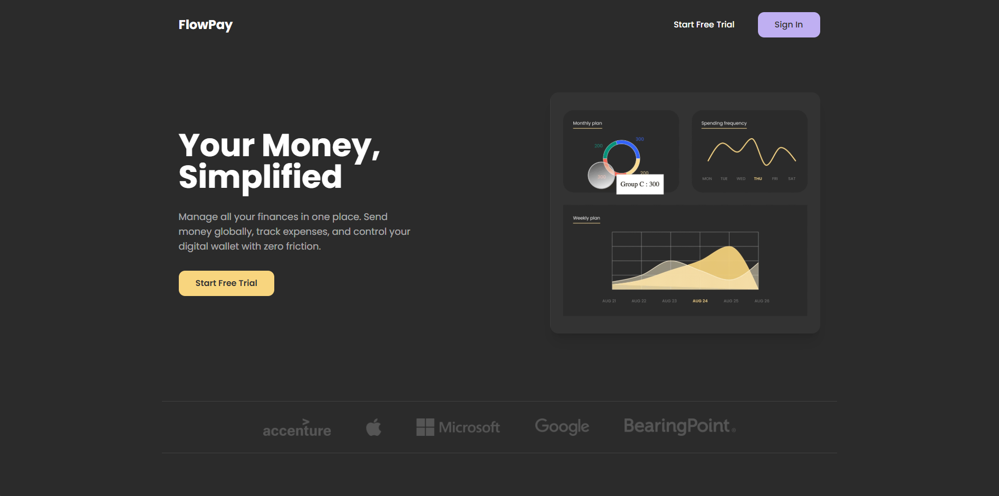

# FlowPay - SaaS Landing Page

A modern, responsive landing page for a financial management SaaS application. Built with React, Vite, and Tailwind CSS, featuring smooth animations and a clean, professional design.



## 🚀 Live Demo

Check out the live demo: [https://saas-landing-page-mocha-chi.vercel.app/](https://saas-landing-page-mocha-chi.vercel.app/)

## ✨ Features

- **Fully Responsive Design** - Optimized for all devices from mobile to desktop
- **Modern UI/UX** - Clean, professional interface with smooth transitions
- **Component-Based Architecture** - Modular React components for easy maintenance
- **Tailwind CSS Styling** - Utility-first CSS framework for rapid development
- **Fast Performance** - Built with Vite for lightning-fast hot module replacement
- **SEO Friendly** - Semantic HTML and optimized meta tags

## 🎯 Sections

The landing page includes the following sections:

1. **Header** - Navigation bar with logo and menu items
2. **Hero Section** - Eye-catching introduction with CTA button
3. **Firms** - Trusted by leading companies showcase
4. **Preview** - Product preview with visual demonstrations
5. **Features** - Key features highlighting:
   - Smart Budgeting with AI-powered insights
   - Zero Transaction Fees for global transfers
   - Multi-Currency Wallet support
6. **Testimonial** - Customer success story with ratings
7. **Contact CTA** - Call-to-action for user engagement
8. **Footer** - Links and additional information

## 🛠️ Built With

- **React 19.2.0** - UI library for building user interfaces
- **Vite 7.2.4** - Next-generation frontend build tool
- **Tailwind CSS 3.4.1** - Utility-first CSS framework
- **PostCSS** - Tool for transforming CSS
- **ESLint** - Code quality and consistency

## 📦 Installation

1. Clone the repository:

```bash
git clone https://github.com/tolgab35/saas-landing-page.git
cd saas-landing-page
```

2. Install dependencies:

```bash
npm install
```

3. Start the development server:

```bash
npm run dev
```

4. Open your browser and navigate to `http://localhost:5173`

## 🚀 Available Scripts

- `npm run dev` - Start development server
- `npm run build` - Build for production
- `npm run preview` - Preview production build
- `npm run lint` - Run ESLint for code quality checks

## 📁 Project Structure

```
saas-landing-page/
├── public/             # Static assets
├── src/
│   ├── assets/        # Images, icons, and media files
│   ├── components/    # React components
│   │   ├── ContactCTA.jsx
│   │   ├── Features.jsx
│   │   ├── Firms.jsx
│   │   ├── Footer.jsx
│   │   ├── Header.jsx
│   │   ├── Hero.jsx
│   │   ├── Preview.jsx
│   │   └── Testimonial.jsx
│   ├── App.jsx        # Main application component
│   ├── index.css      # Global styles
│   └── main.jsx       # Application entry point
├── index.html         # HTML template
├── package.json       # Project dependencies
├── tailwind.config.js # Tailwind CSS configuration
├── vite.config.js     # Vite configuration
└── README.md          # Project documentation
```

## 🎨 Customization

### Colors

The project uses a custom color scheme defined in Tailwind CSS. Main colors include:

- Background: `#2B2B2B` (Dark gray)
- Accent: `#F8D57E` (Golden yellow)
- Highlight: `#BFAFF2` (Light purple)

### Typography

The project uses the **Poppins** font family from Google Fonts for a modern, clean look.

## 🌐 Deployment

The project is deployed on Vercel. To deploy your own version:

1. Push your code to GitHub
2. Import your repository to Vercel
3. Configure build settings (Vite preset is auto-detected)
4. Deploy!

## 📄 License

This project is open source and available for personal and commercial use.

## 👨‍💻 Author

Created by [tolgab35](https://github.com/tolgab35)

## 🤝 Contributing

Contributions, issues, and feature requests are welcome! Feel free to check the issues page.

---

Made with ❤️ using React and Tailwind CSS
